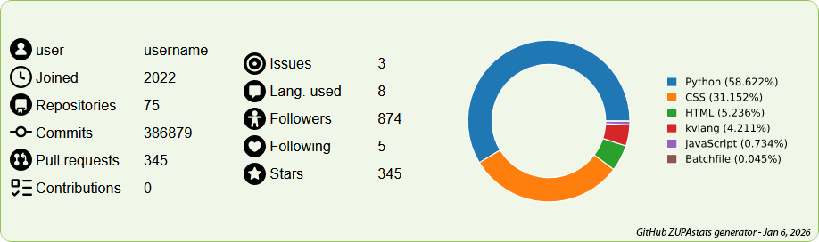
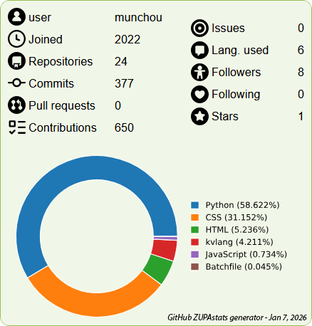

*Last updated on January 7, 2026*

# GitHub ZUPAstats generator

A user stats generator in Python with basic info such as number of commits, repositories, follow-ers/ing, PR, contributions, etc. and a generated graph of languages use

NOT THOROUGHLY TESTED (yet)

EDIT JANUARY 7 2026: GitHub doesNOT allow simple HTML code (flexbox, true SVG, and whatnot), so I must think of a way of generating a full picture instead of code. I'll share the HTML generating part anyway...

Contributions of any kind are welcome =)

(don't mind the crappy README, I'll make it look good later)

# How it works: the program renders HTML code that you simply need to paste in your profile
- Input the target username (typo = user not found).
- Input if you want to also generate the pie chart of the languages use ("y"/"n", typo = try again).
- The target data is retrieved, processed and saved in a JSON file to be used as cached information. This is mainly useful for a public server version. The default minimum days are set to 15 days (around half a month) but can be easily changed in the main script.
- That data is then loaded and used to generate the output HTML code.
- If you chose to generate the pie chart, the data about the used programming languages is processed (total occurences, respective occurences, calculation of percentage).
- Once done, an HTML page is generated (for now) and can be used however you wish (no commcercial use, obviously).

# Current state:
All intended user data retrieved and processed (if needed): username, joined year, number of commits, number of pull requests, number of contributions, number of stars, number of followers, number of following, number of issues, number of repositories, number of languages used, number of total_lang_occurencies: {total_lang_occurencies}

# Files and folders
- github_stats_imgs (folder): contains the images for the final render
JAN 6 2026 CHANGE: I found that generating using locally stored images wouldn't be user friendly, so now it's directly summoning the official SVG images from https://primer.style/octicons/ (hopefully it lasts). I'm leaving the edited images (from the same website, but I converted them one by one into PNG images).
- user_img (folder): contains the user's generated pie chart SVG image about languages use, name "[username]_github_stats_languages.svg"
- .env file (not present, obviously), with the line "GITHUB_TOKEN=" where you add your own token (don't use quotation marks)
- github_stats_api_piemaker.py
- github_stats_api_retrievers.py
- github_stats_api_stats_generator.py

More explanations to come later

# Current version (Jan 6, 2026)

